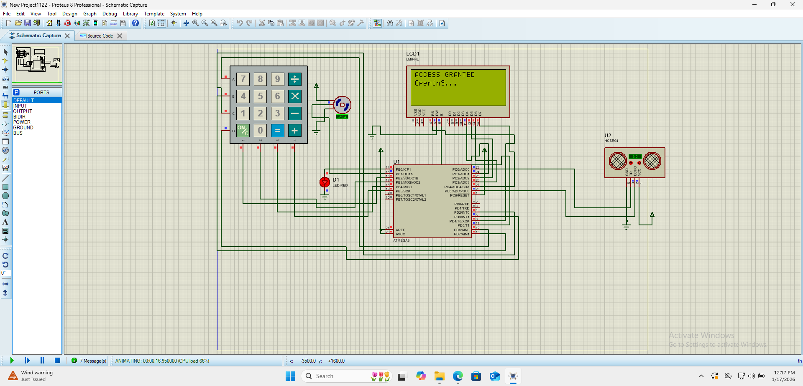
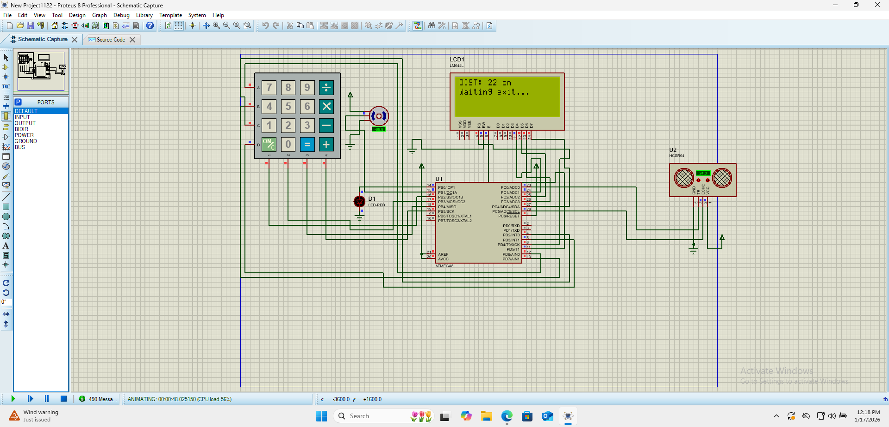

# 🛡️ Smart Gate Automation System
### Microcontroller-Based Security & Access Control

## 📝 Overview
This project implements a secure, automated gate control system using an **ATmega8 microcontroller**. It moves beyond simple motion detection by enforcing **two-factor logic**:
1.  **Authentication:** A 4-digit keypad PIN is required to trigger the opening mechanism.
2.  **Safety Loop:** An ultrasonic sensor continuously monitors the vehicle's position, ensuring the gate never closes while a vehicle is passing through.

## ⚙️ System Workflow (Finite State Machine)
The system operates on a state-machine architecture. Below demonstrates the logic flow during a successful entry cycle.

| State | Visualization | Description |
| :--- | :--- | :--- |
| **1. Idle / Locked** |  | System waits for user input. The LCD prompts for a password and masks the input (****) for security. |
| **2. Authentication** |  | If the PIN matches the stored hash, the **Servo Motor** is driven to 90° (Open) and access is granted. |
| **3. Safety Hold** |  | **Key Feature:** The system does *not* use a simple timer to close. It uses an **Ultrasonic Sensor** to hold the gate open as long as the vehicle is detected (Distance < 20cm). |
| **4. Auto-Close** |  | Once the vehicle clears the area (Distance > 20cm), the servo returns to 0° and the system resets to the Locked state. |

## 🛠️ Hardware & Tech Stack
* **Microcontroller:** ATmega8 (AVR Architecture)
* **Input:** 4x3 Matrix Keypad (PIN Entry)
* **Output:** 16x2 LCD Display (Status Feedback)
* **Actuator:** Servo Motor (Gate Mechanism PWM Control)
* **Sensor:** HC-SR04 Ultrasonic Sensor (Object Detection)
* **Simulation:** Proteus Design Suite

## 📂 File Structure
* `main.c`: Core application logic (Keypad scanning, PWM generation, Sensor interrupts).
* `final project.pdsprj`: Complete Proteus simulation schematic.

## 🚀 How to Run
1.  Clone this repository.
2.  Open `final project.pdsprj` in Proteus 8.
3.  Compile `main.c` (using AVR-GCC or Microchip Studio) to generate the HEX file.
4.  Load the HEX file into the ATmega8 component.
5.  Run simulation and enter the default PIN (check code for pin, usually `1234` or similar).

---
*Created by [Abdullakim](https://github.com/Abdullakim1)*
